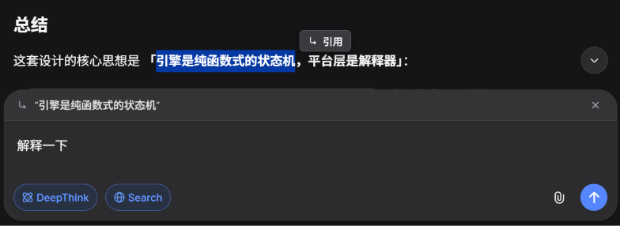
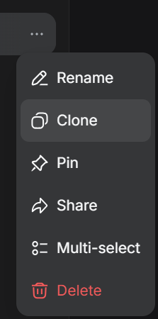

# DeepSeek Enhance

**English** | [中文](README_zh.md)

> [!WARNING]
> This project is **unofficial** and not affiliated with or endorsed by DeepSeek.  
> "DeepSeek", "DSeek", and the DeepSeek logo are trademarks and copyrights of DeepSeek.

A collection of lightweight userscripts to improve the [DSeek](https://chat.deepseek.com/) (DeepSeek Chat) experience.

| Script                    | Description                                                              | Links                                                                                                                                                                                       |
| :------------------------ | :----------------------------------------------------------------------- | :------------------------------------------------------------------------------------------------------------------------------------------------------------------------------------------ |
| **Auto Collapse Thought** | Automatically collapses the "Thinking" process block.[^collapse-thought] | [GitHub](https://github.com/ShenMian/deepseek-enhance/raw/refs/heads/main/src/auto-collapse-thought.user.js), [Greasy Fork](https://greasyfork.org/en/scripts/575582-dseek-auto-collapse)   |
| **Quote Reply**           | Adds a floating menu to quote selected text.                             | [GitHub](https://github.com/ShenMian/deepseek-enhance/raw/refs/heads/main/src/quote-reply.user.js), [Greasy Fork](https://greasyfork.org/en/scripts/576008-dseek-quote-reply)               |
| **Clone Conversation**    | Adds a `Clone` option to the native chat menu.[^clone]                   | [GitHub](https://github.com/ShenMian/deepseek-enhance/raw/refs/heads/main/src/clone-conversation.user.js), [Greasy Fork](https://greasyfork.org/en/scripts/575540-dseek-clone-conversation) |
| ~~**Auto Expert**~~       | ~~Automatically switches to the Expert model.~~                          | ~~[GitHub](https://github.com/ShenMian/deepseek-enhance/raw/refs/heads/main/src/auto-expert.user.js), [Greasy Fork](https://greasyfork.org/en/scripts/575568-dseek-auto-expert)~~           |

[^collapse-thought]: There is currently a page-jump issue when collapsing the thought block.
[^clone]: This will generate a **public** share link for the conversation.

## Screenshots

<table style="width: 100%; border-collapse: collapse;">
  <tr>
    <td style="width: 70%; border: 1px solid #d0d7de; padding: 12px; vertical-align: middle;">
      
    </td>
    <td style="width: 30%; border: 1px solid #d0d7de; padding: 12px; vertical-align: middle;">
      
    </td>
  </tr>
</table>

## Installation

1. Install a user script manager like **[Violentmonkey](https://violentmonkey.github.io/)** (MIT License) or [Tampermonkey](https://www.tampermonkey.net/) (proprietary) for your browser.
2. Click the links in the table above to install the script.

## License

Licensed under either of

- [Apache License, Version 2.0](LICENSE-APACHE)
- [MIT license](LICENSE-MIT)

at your option.
